## **`Information for the Final Project Repository`**

### **_`Title: DevPro Learning`_**

---

### **`Kelompok 6:`**

- **Harun Al Hakim**
- **Rizki Kurnianingsih**
- **Muhamad Bintang Alfarizki**
- **Rovines Derlan Hutabarat**
- **Teofilus Desius Ziraluo**

---

### **`Ketentuan Repository:`**

- ❌ Dilarang mengakses atau menyalahgunakan repositori kelompok lain.
- 💻 Fokus pada pengerjaan kelompok masing-masing.
- 🤓 Untuk kelompok lain bisa sharing, melihat proses, serta memicu semangat untuk memberikan hasil yang terbaik pada projectnya masing-masing. 💪💪💪

---

### **`Design & Documentation:`**

- [Slide of Presentation](https://docs.google.com/presentation/d/1vBsycABDKSVW2u49wU9D6zn2jmZ2d-u1Ln8aIn8jeeM/edit?usp=sharing)
- [BPMN](https://drive.google.com/file/d/1btRCx5kGTLytgNJkzdVQE_1vDcpShWq-/view?usp=sharing)
- [Use Case](https://drive.google.com/file/d/1btRCx5kGTLytgNJkzdVQE_1vDcpShWq-/view?usp=sharing)
- [Entity Relational Diagram](https://drive.google.com/file/d/1btRCx5kGTLytgNJkzdVQE_1vDcpShWq-/view?usp=sharing)
- [Data Dummy](https://docs.google.com/spreadsheets/d/1ydZpEoqUuwcYv1IFHPfIrQ0GB3hgGPOUd-sXmQGy9HQ/edit?usp=sharing)
- [Progress of Project](https://docs.google.com/spreadsheets/d/19E78qnOJODgxfsP4NqAyg3y5IwQ_nZCxiMKqyV_5gkY/edit?usp=sharing)

---

### **`Screenshot:`**

- Login
  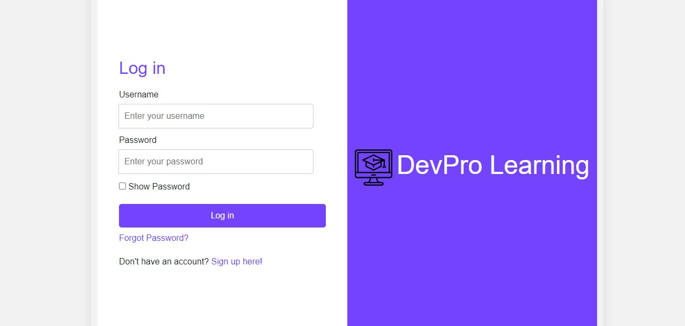

- Registration
  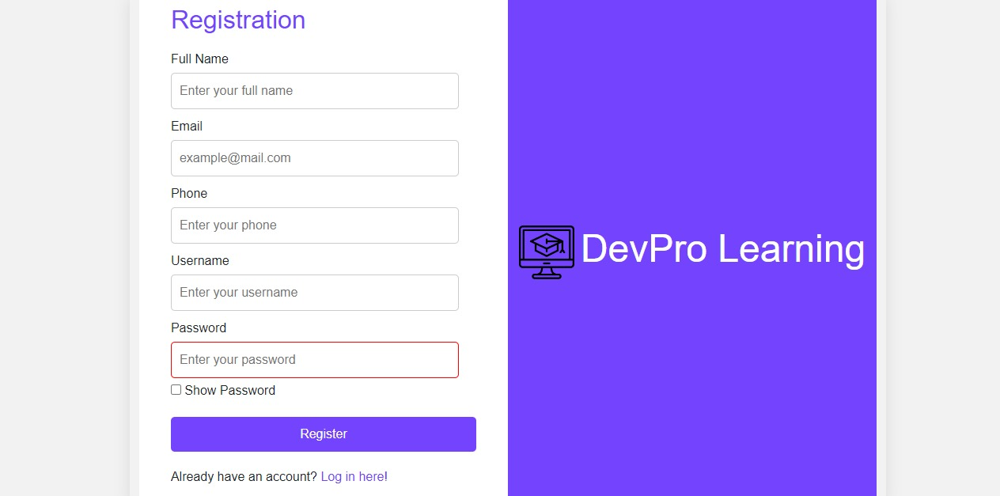

- Forgot Password
  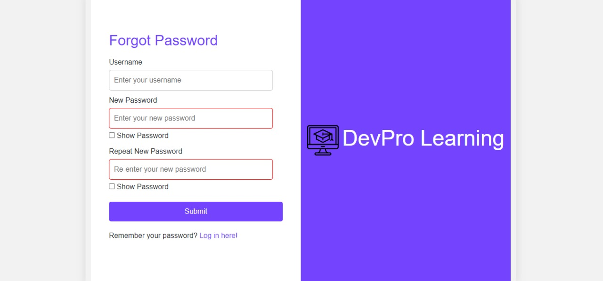

- Landing Page
  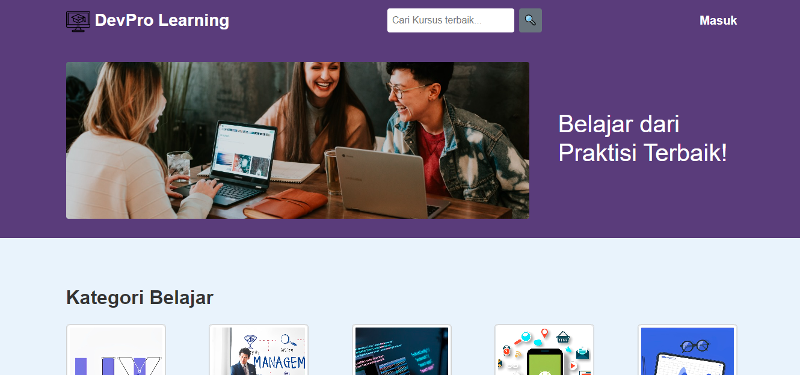

- Landing Page
  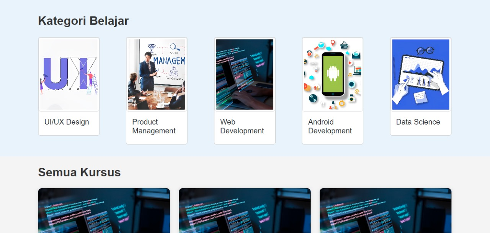

- Landing Page
  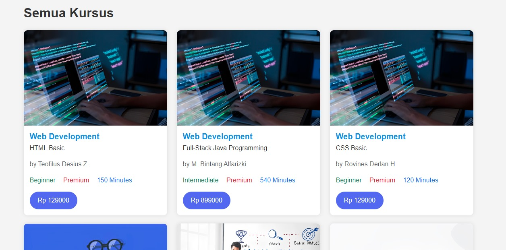

- Admin
  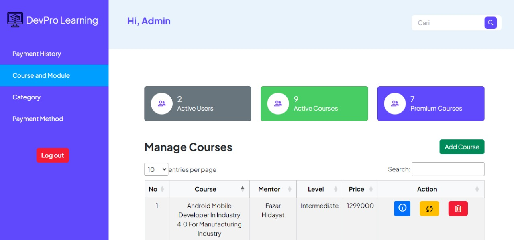

- Admin
  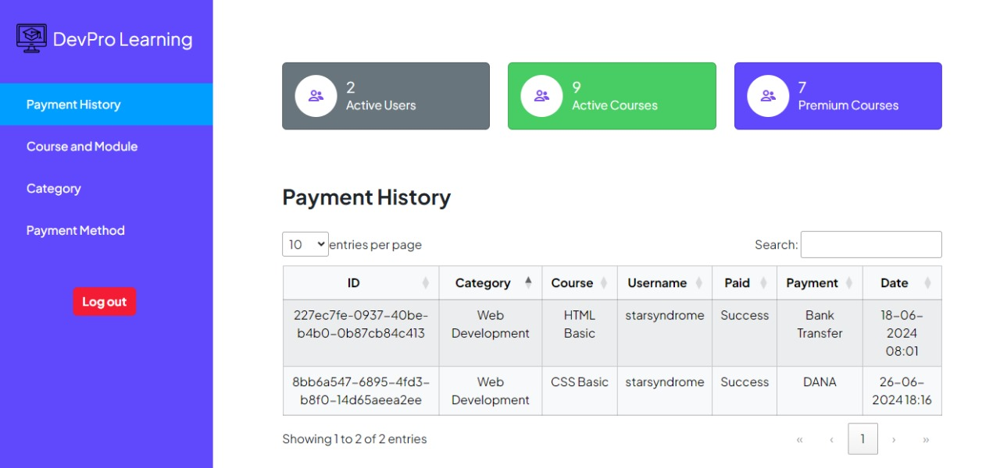

- Dashboard
  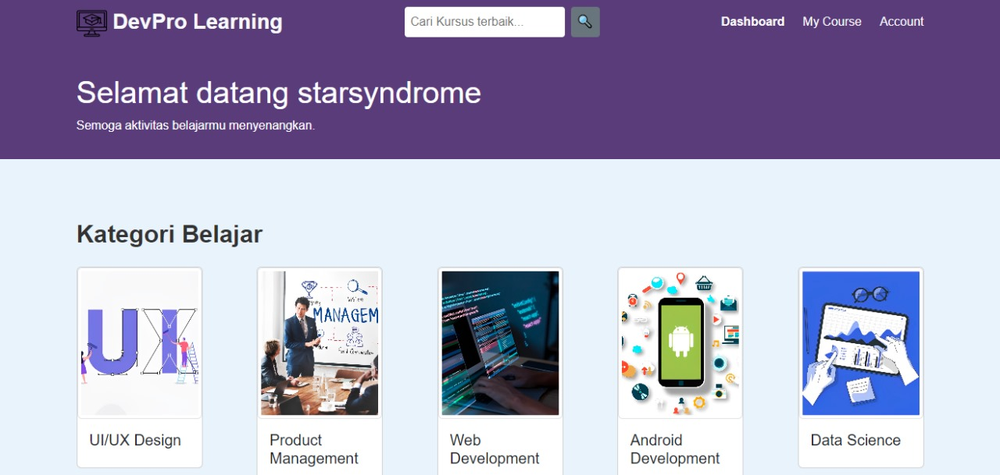

- My Courses
  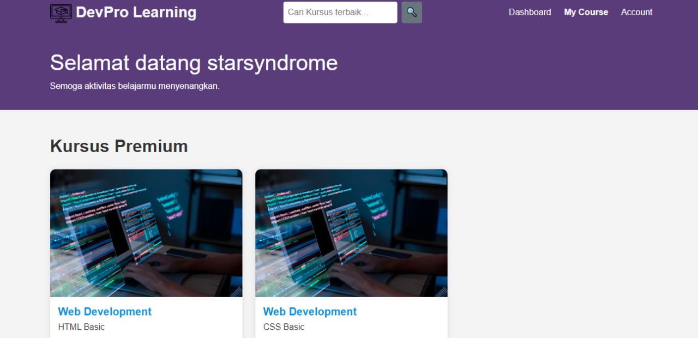

- Account Profile
  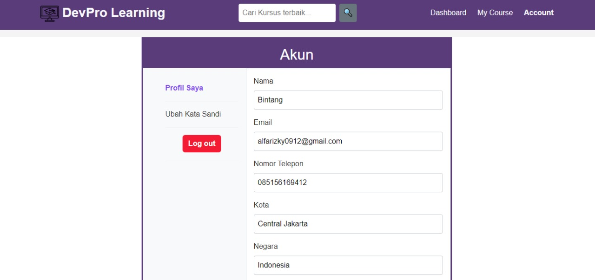

- Course Details
  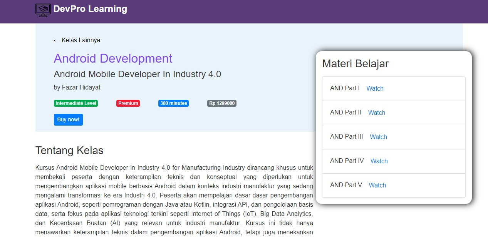

- Payment
  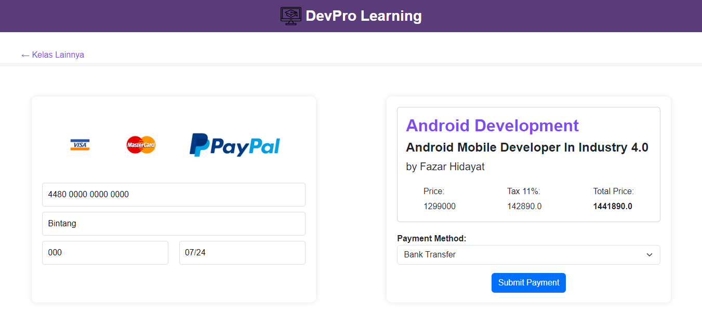

- Payment Success
  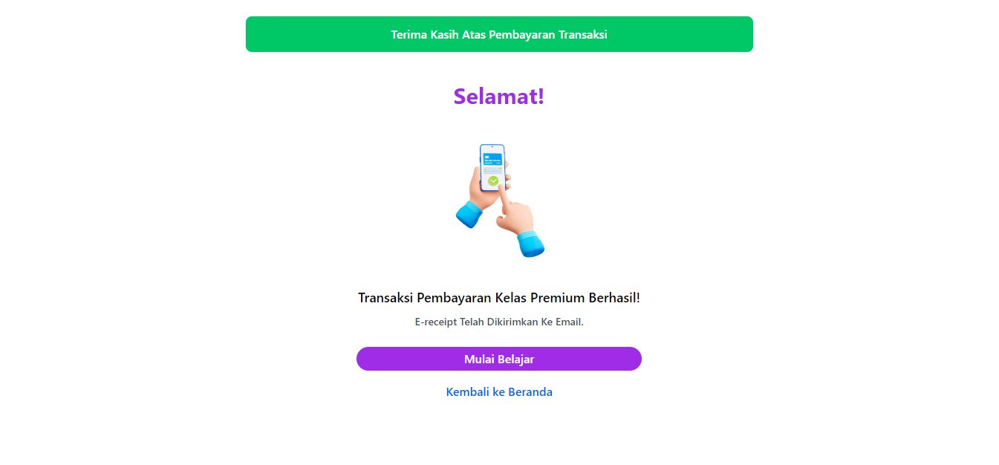

- Watch Course Videos
  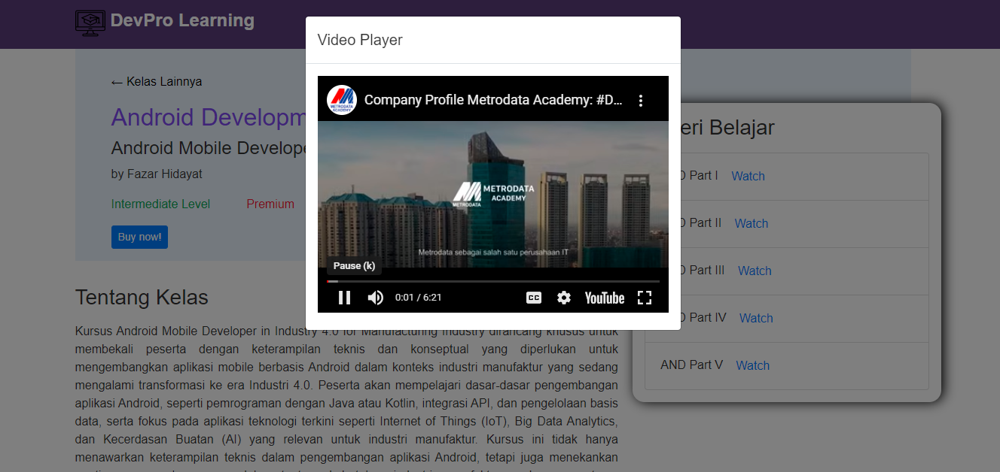

---

### **`Pembagian Tugas:`**

[Progress of Project](https://docs.google.com/spreadsheets/d/19E78qnOJODgxfsP4NqAyg3y5IwQ_nZCxiMKqyV_5gkY/edit?usp=sharing)

---

### **`Ketentuan Implementasi Repository:`**

- Silakan clone repository yang sudah disediakan untuk setiap kelompoknya masing-masing.
- Setelah clone, silakan masukkan folder project **`backend`** & **`frontend`** yang nanti teman-teman buat.
- Untuk folder **`materials`** bisa diarsipkan dari `hasil akhir segment 4` export dari:
  - **Testing endpoint pada postman dengan extension `.postman_collection`**
  - **Database project dengan extension `.sql`**
  - **Create folder `img` untuk menempatkan gambar screenshot project**

**`NOTE:` di bawah ini merupakan contoh struktur dari folder project.**

```
|-- .gitignore
|-- README.md
|-- materials
|-- serverapp
    |-- .mvn
    |-- src
        |-- main
        |-- test/java/id/co/mii/serverapp
    |-- .gitignore
    |-- mvnw
    |-- mvwn.cmd
    |-- pom.xml
|-- clientapp
    |-- .mvn
    |-- src
        |-- main
        |-- test/java/id/co/mii/clientapp
    |-- .gitignore
    |-- mvnw
    |-- mvwn.cmd
    |-- pom.xml
```
